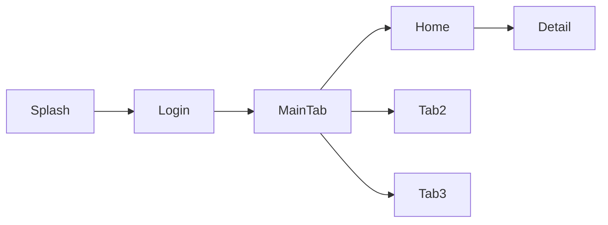

# 🗺️ App Map: [App Name]

**Generated:** [Date]
**Source:** [Apktool dir path]

---

## 📱 Identity

| Property | Value |
|----------|-------|
| Package | [com.example.app] |
| App Name | [Display Name] |
| Min SDK | [value] |
| Target SDK | [value] |
| Screens | [count] Activities |
| Services | [count] |
| Receivers | [count] |
| Providers | [count] |

---

## 🧭 Screen Flow

```
┌──────────┐    ┌──────────┐    ┌──────────────┐
│  Splash  │───→│  Login   │───→│  Main Tab    │
└──────────┘    └──────────┘    ├──────────────┤
                                 │ Tab 1: Home  │
                                 │ Tab 2: ...   │
                                 │ Tab 3: ...   │
                                 └──────────────┘
                                       │
                                 ┌─────┴─────┐
                                 │  Detail   │
                                 │  ...      │
                                 └───────────┘
```

*Or use Mermaid:*


---

## 📦 Library Landscape

### ✅ Reuse (add to build.gradle)
| Library | Detected Package | Latest Version | Action |
|---------|-----------------|----------------|--------|

### 🔄 Replace (legacy → modern)
| Old Library | Detected Package | Modern Replacement |
|-------------|-----------------|-------------------|

### 🔵 Firebase / Google SDKs
| SDK | Detected | Action |
|-----|----------|--------|

### 📱 Native (.so) — Keep
| File | Architecture | Notes |
|------|-------------|-------|

### 🏷️ App Code (rebuild in Kotlin)
| Package | Estimated Module |
|---------|-----------------|

### ❓ Unknown (needs investigation)
| Package | Path | Possible Library |
|---------|------|-----------------|

---

## 📊 Complexity Estimate

| Area | Rating | Notes |
|------|--------|-------|
| Data Layer | ●●●○○ | [N] APIs, [N] local DB, [N] DataStores |
| Core Logic | ●●○○○ | [N] crypto utils, [N] formatters |
| UI Screens | ●●●●○ | [N] screens, [N] complex layouts |
| SDK Integration | ●●○○○ | [N] third-party, [N] native libs |

---

## 🔍 Key Observations

- [Notable patterns: obfuscation level, unusual architecture, etc.]
- [Security observations: certificate pinning, root detection, etc.]
- [Risks: native libs without source, proprietary SDKs, etc.]

---

> **Next:** Anh review map này, có gì cần điều chỉnh không?
> → OK → Proceed to Phase 1 (Architecture Design)
