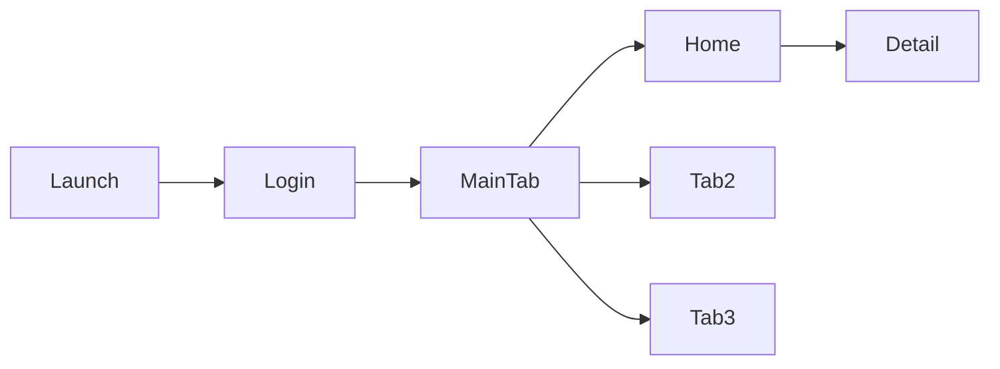

# 🗺️ App Map: [App Name] (iOS)

**Generated:** [Date]
**Source:** [Decrypted .app bundle path]

---

## 📱 Identity

| Property | Value |
|----------|-------|
| Bundle ID | [com.example.app] |
| App Name | [Display Name] |
| Min iOS | [value] |
| ViewControllers | [count] |
| Frameworks | [count] embedded |
| Capabilities | [push, apple pay, etc.] |

---

## 🧭 Screen Flow

---

## 📦 Framework Landscape

### ✅ Reuse (add via SPM)
| Framework | Detected | Latest Version | Action |
|-----------|----------|----------------|--------|

### 🔄 Replace (legacy → modern Swift)
| Old Framework | Detected | Modern Replacement |
|---------------|----------|-------------------|

### 🍏 Apple Frameworks
| Framework | Purpose | SwiftUI Equivalent |
|-----------|---------|--------------------|

### 📱 Native Libraries
| File | Notes |
|------|-------|

### 🏷️ App Code (rebuild in Swift)
| Class Prefix | Estimated Module |
|-------------|-----------------|

### ❓ Unknown
| Framework | Notes |
|-----------|-------|

---

## 📊 Complexity Estimate

| Area | Rating | Notes |
|------|--------|-------|
| Data Layer | ●●●○○ | [N] APIs, [N] local DB, keychain |
| Core Logic | ●●○○○ | [N] crypto, [N] formatters |
| UI Screens | ●●●●○ | [N] screens, [N] complex |
| SDK Integration | ●●○○○ | [N] frameworks, [N] native |

---

## 🔍 Key Observations

- [Notable patterns]
- [Security observations]
- [Risks]

---

> **Next:** Review map → Phase 1 (Architecture)
