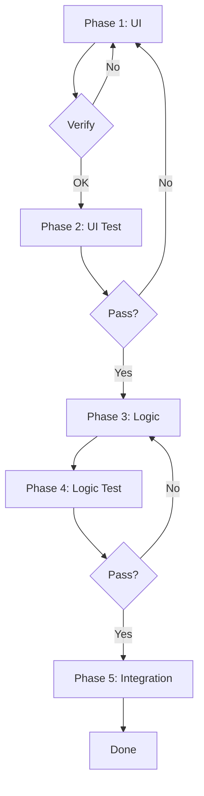

# UI-First Auto Execution Workflow

## Philosophy: UI-First Spec-Driven Development

**Core Principle**: Build and verify UI first, then implement logic with confidence  
**Purpose**: Ensure polished UX before investing in complex logic  
**Benefit**: Reduced rework, better UX, improved code reusability

### Key Benefits

- **User-Centric**: UI validated before logic implementation
- **Reduced Rework**: UI changes don't affect completed logic
- **Better Planning**: Logic design informed by confirmed UI
- **Code Reusability**: Components designed for reuse from start
- **Quality Focus**: Clear quality gates per phase

## Workflow Phases Overview



## Phase 1: UI Implementation

### Objectives
Build complete UI with design specs, animations, responsive design, and reusable components

### Execution Steps

```yaml
# 1. Spec Analysis
ui_spec_review:
  - Read docs/specs/[feature]/design.md
  - Identify screens, components, UI states
  - Note animations, transitions, reusable parts

# 2. Component Architecture
component_structure:
  - Design hierarchy, shared components
  - Plan composition, props, UI state management

# 3. Build Sequence
build_sequence:
  1. Shared: Buttons, inputs, cards, tokens, layouts
  2. Feature: Screen layouts, components, custom elements
  3. Polish: Animations, micro-interactions, responsive, a11y

# 4. Implementation Rules
implementation_rules:
  - Use mock data, implement all visual states
  - Add placeholder handlers, focus on visual perfection
  - No business logic, API calls, or data persistence yet
```

### Quality Checklist

- [ ] All screens/states implemented (loading, error, empty, success)
- [ ] Smooth animations (60fps), responsive design
- [ ] Accessibility (VoiceOver, Dynamic Type)
- [ ] Consistent design system, reusable components

## Phase 2: UI Verification Gate

**MANDATORY CHECKPOINT**: User must approve UI before logic

### Verification Process

```yaml
# 1. Demo Prep
demo_preparation:
  - Build app, prepare scenarios
  - Document limitations (mock data)

# 2. Review Checklist
review_checklist:
  Visual: Colors, typography, spacing, icons
  Interactions: Animations, transitions, touch targets, gestures
  UX: Navigation, hierarchy, error/loading states
  Responsive: Devices, orientations, content lengths
  A11y: VoiceOver, Dynamic Type, contrast

# 3. Feedback
feedback_format:
  changes_required: [List, priority, affected screens]
  approval_status: approved | minor_changes | major_changes

# 4. Decision
gate_decision:
  approved/minor_changes: Document → Phase 3
  major_changes: Document → Phase 1
```

**Gate Doc**: Create `docs/specs/[feature]/ui-approval.md` with review date, status, feedback, changes, approver, next steps

## Phase 3: UI Testing

### Test Implementation

```yaml
# Snapshot, Component, Accessibility, Visual Regression Tests
tests:
  snapshot: All screens, states, devices, light/dark
  component: Rendering, props, state, interactions
  accessibility: VoiceOver, Dynamic Type, contrast, touch sizes
  visual_regression: Compare designs, detect changes
```

**Run**: `npm run test:ui` or `./scripts/run-ui-tests.sh`

### Quality Gate
- [ ] All tests pass (snapshot, component, a11y, visual regression)
- [ ] No warnings/errors, performance < 16ms render

## Phase 4: Logic Implementation

### Objectives
Implement business logic, API integration, persistence, error handling, reusability

### Planning & Strategy

```yaml
# Architecture
architecture_review:
  - Review UI, design data flow, state management
  - Identify reusable logic, design service layer

# Reusability
reusability_planning:
  shared: Common patterns → services/utilities
  feature: Isolated logic, dependency injection, testability

# Implementation
implementation:
  1. Service Layer: Interfaces, API clients, repositories, logic, errors
  2. State: Connect UI, updates, side effects, async
  3. Integration: Replace mocks, connect handlers, add states/errors/validation

# Build Sequence
logic_build:
  1. Core: API clients, repositories, utilities
  2. Business: Feature logic, transformations, validation
  3. State: Containers, actions/reducers, side effects
  4. Integration: Connect UI, replace mocks, errors
```

### Code Reusability Patterns

**Service Pattern**
```typescript
interface DataService<T> {
  fetch(id: string): Promise<T>
  create(data: Partial<T>): Promise<T>
  update(id: string, data: Partial<T>): Promise<T>
  delete(id: string): Promise<void>
}
class UserService implements DataService<User> { /* ... */ }
```

**Repository Pattern**
```typescript
abstract class BaseRepository<T> {
  abstract fetch(id: string): Promise<T>
  abstract save(data: T): Promise<void>
  protected handleError(error: Error): void { /* shared */ }
}
class UserRepository extends BaseRepository<User> { /* ... */ }
```

**Hook Pattern**
```typescript
function useDataFetch<T>(fetcher: () => Promise<T>) {
  const [data, setData] = useState<T | null>(null)
  const [loading, setLoading] = useState(false)
  const [error, setError] = useState<Error | null>(null)
  return { data, loading, error, refetch }
}
```

### Quality Checklist
- [ ] Logic, API, persistence complete
- [ ] Comprehensive error handling
- [ ] Reusable, composable, testable code
- [ ] SOLID principles, dependency injection

## Phase 5: Logic Testing

### Test Implementation

```yaml
tests:
  unit: Services, logic, transformations, validation (mock deps)
  integration: API, persistence, state, errors
  e2e: User flows, real data, errors, edge cases
```

**Run**: `npm run test:logic|integration|e2e|coverage`

### Quality Gate
- [ ] Coverage > 80%, all tests pass
- [ ] E2E for critical flows, no critical bugs
- [ ] Performance acceptable, errors verified

## Phase 6: Integration & Final Validation

### Integration Steps

```yaml
integration:
  final: Remove mocks, connect UI to logic, verify states/errors
  testing: Run all UI/logic/integration/e2e/performance tests
  uat: Build RC, prepare scenarios, document issues, schedule UAT
```

### Final Quality Gate
- [ ] All tests pass, no critical bugs
- [ ] Performance, accessibility verified
- [ ] Documentation complete, user acceptance obtained

## Automation Support

### Task Spec Format

```yaml
feature_task:
  id: "feature_001"
  name: "User Profile"
  
  phase_1_ui:
    components: [{name: "ProfileHeader", type: "component", reusable: true}]
    states: [loading, error, empty, success]
    animations: [fade_in, slide_up, spring_bounce]
  
  phase_2_verification:
    demo_scenarios: ["View with data", "loading", "error"]
    approval_required: true
  
  phase_3_ui_testing:
    test_types: [snapshot, component, accessibility, visual_regression]
  
  phase_4_logic:
    services: [{name: "UserService", reusable: true}]
    integrations: [{api: "GET /users/:id"}, {storage: "UserDefaults"}]
  
  phase_5_logic_testing:
    test_types: [unit, integration, e2e]
    coverage_target: 80
  
  phase_6_integration:
    validation: [full_test_suite, performance_check, uat_approval]
```

### Execution Control

```yaml
execution_rules:
  phase_gates:
    - {phase: ui_implementation, next: ui_verification, auto_proceed: false}
    - {phase: ui_verification, next: ui_testing, auto_proceed: true, conditions: [approval_status: approved]}
    - {phase: ui_testing, next: logic_implementation, auto_proceed: true, conditions: [all_tests_pass: true]}
    - {phase: logic_implementation, next: logic_testing, auto_proceed: true}
    - {phase: logic_testing, next: integration, auto_proceed: true, conditions: [coverage: ">=80%", all_tests_pass: true]}
    - {phase: integration, next: complete, auto_proceed: false, conditions: [uat_approved: true]}
```

## Error Handling

**UI Errors**: Syntax → fix/rebuild | Design → spec review | Component → isolate/fix  
**UI Rejection**: Document → prioritize → Phase 1 → schedule review  
**UI Test Fail**: Identify → fix → re-run → update snapshots  
**Logic Errors**: API → check integration | State → review mgmt | Data → validate transforms  
**Logic Test Fail**: Fix → improve coverage → re-run  
**Integration Issues**: Isolate → fix → re-test → validate flow

---

**Success**: Polished UI approved, comprehensive tests, clean reusable code, smooth UI-logic integration